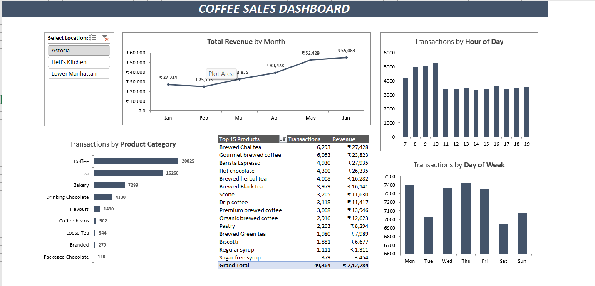

# ☕ Coffee Sales – Excel Dashboard  

This project analyzes **Coffee Sales across three New York locations** – Astoria, Hell’s Kitchen, and Lower Manhattan.  
The interactive Excel dashboard highlights **revenue, transactions, time patterns, and product performance**, helping identify sales opportunities and customer behavior.  

---

## 📊 Dashboard Features  
The Coffee Sales Dashboard provides the following insights:  
- **Revenue Trends** – Monthly sales revenue (Jan–Jun).  
- **Transactions by Hour of Day** – Identifies peak customer hours.  
- **Transactions by Day of Week** – Weekday vs weekend customer activity.  
- **Transactions by Product Category** – Coffee, Tea, Bakery, Chocolate, Flavours, and more.  
- **Top 15 Products** – Best sellers by transactions & revenue.  
- **Location Filter** – Interactive slicer for Astoria, Hell’s Kitchen, and Lower Manhattan.  

---

## 📸 Dashboard Preview  
  

---

## 🔑 Key Business Insights  
- 📈 **Total Revenue:** ₹6,29,499 from **1,44,919 transactions**.  
- ⏰ **Peak Hours:** 8 AM – 10 AM show the highest customer activity.  
- 📅 **Busiest Days:** Monday & Friday have the most transactions.  
- ☕ **Product Category Leaders:**  
  - Coffee – 58,416 transactions  
  - Tea – 45,449 transactions  
- 🏆 **Top-Selling Products:**  
  - Brewed Chai Tea (₹77,082 revenue)  
  - Barista Espresso (₹91,406 revenue)  
  - Hot Chocolate (₹72,416 revenue)  
- 📍 **Astoria outperforms other locations** in overall revenue.  

---

## 🛠️ Skills Practiced  
- Excel Data Cleaning & Processing  
- Pivot Tables & Pivot Charts  
- Slicers & Interactive Filtering  
- Dashboard Formatting & Layout Design  
- Data Visualization & Business Storytelling  

---

## 📂 Files in this Repository  
- `Coffee Sales Dashboard.xlsx` → Interactive Excel dashboard  
- `Coffee Sales Dashboard.pdf` → Dashboard snapshot (quick view)  
- `Dashboard_Screenshot.png` → Dashboard preview image  

---

## 📌 Project Type  
- 📘 **Guided Learning Project** – Excel Dashboard Practice  
- 📊 **Business-focused Data Analysis**  

---

✨ *Created by Haya Parveen*  
